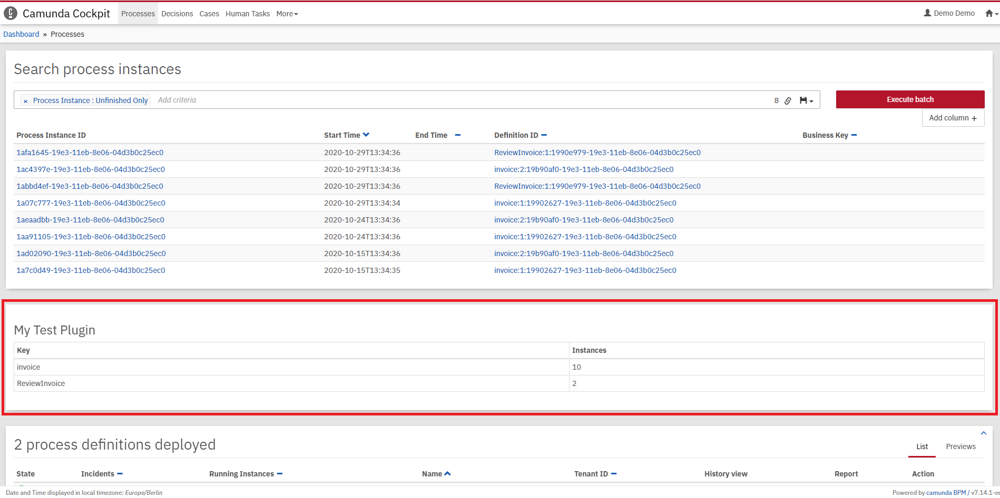

# Camunda Cockpit Plugin
A simple plugin that showcases the plugin system of Cockpit, the process monitoring tool of [Camunda Platform](http://docs.camunda.org).

This project has been generated by the Maven archetype
[camunda-archetype-cockpit-plugin-7.17.0](https://docs.camunda.org/manual/latest/user-guide/process-applications/maven-archetypes/).

## Show me the important parts!

## How to use it?
Build the plugin with `mvn clean install`.

Afterwards, you can install the plugin as described in [our guide](https://github.com/camunda/camunda-bpm-examples/tree/master/cockpit/cockpit-fullstack-count-processes#integrate-into-camunda-bpm-webapp).

Once you installed the plugin it should appear in
[Camunda Cockpit](https://docs.camunda.org/manual/latest/webapps/cockpit/).

## More information
[Cockpit plugins](https://docs.camunda.org/manual/latest/webapps/cockpit/extend/plugins/)

[How to develop a Cockpit plugin](https://github.com/camunda/camunda-bpm-examples/tree/master/cockpit/cockpit-fullstack-count-processes)

Discover more Cockpit plugins in the
[Camunda Cockpit examples](https://github.com/camunda/camunda-bpm-examples/tree/master/cockpit)

## Environment Restrictions
Built and tested against Camunda Platform version 7.17.0.

## License
[Apache License, Version 2.0](http://www.apache.org/licenses/LICENSE-2.0).
